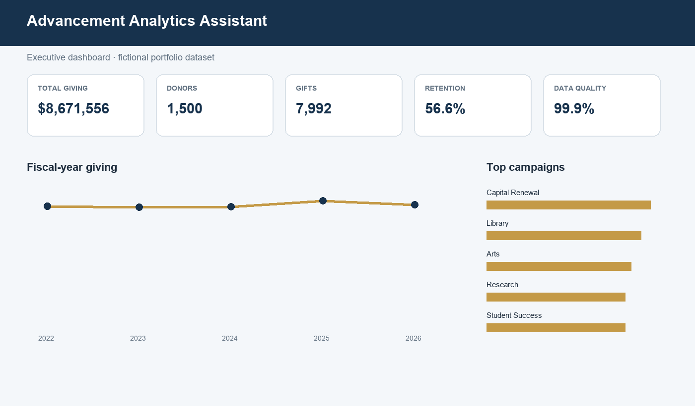
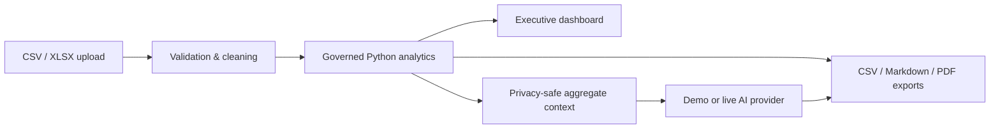
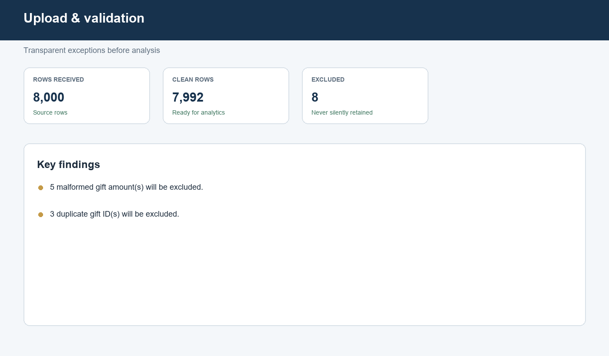
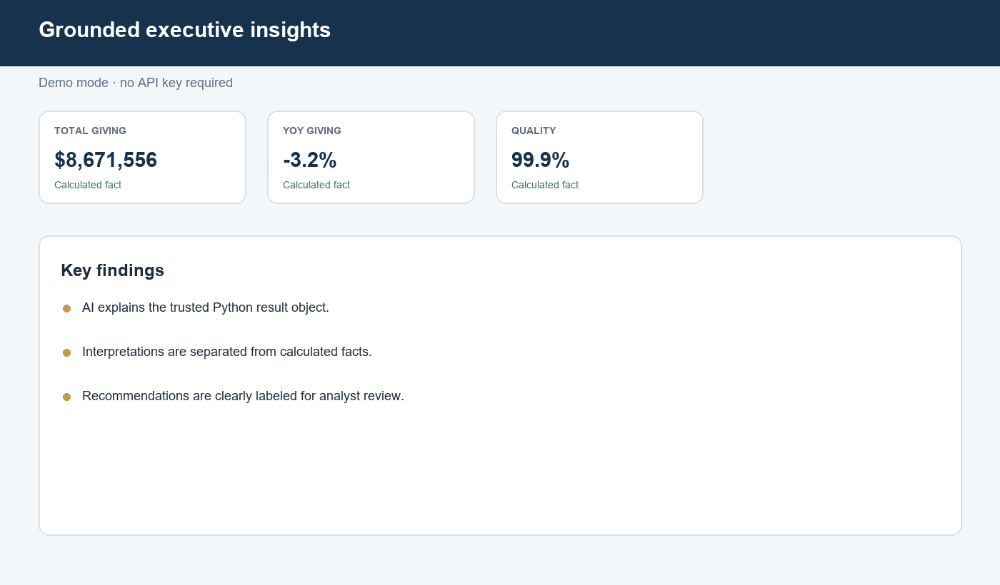
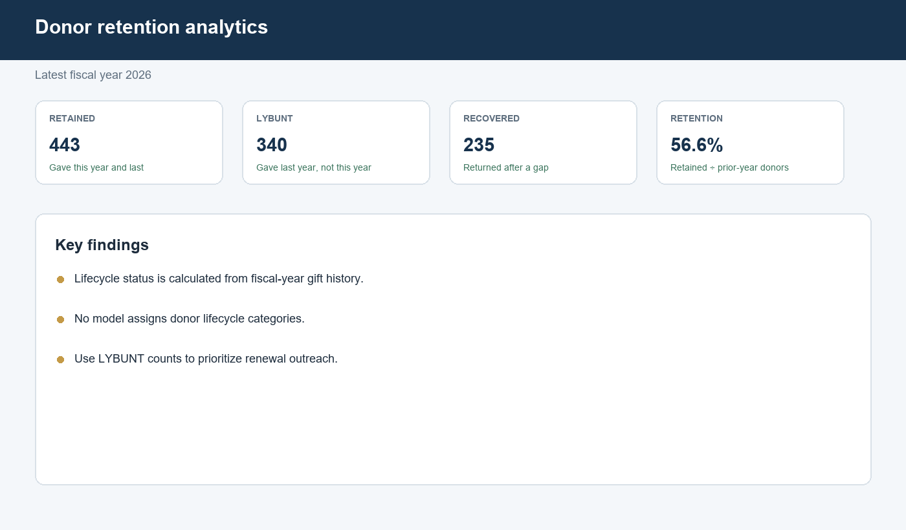
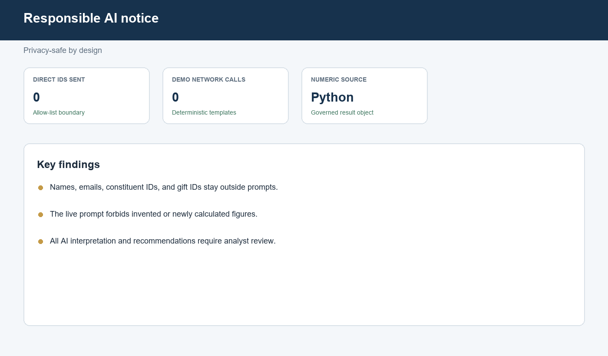

# AI Advancement Analytics Assistant

> A recruiter-ready Streamlit portfolio application that turns fictional Salesforce-style fundraising exports into governed KPIs, privacy-safe AI interpretation, and executive reports.



## About the analyst

Built by Aristides Ramos, a Senior Data Analyst specializing in Salesforce analytics, business intelligence, data governance, fundraising analytics, and automated executive reporting.

LinkedIn:  
https://www.linkedin.com/in/aristides-ramos-51a41497

## Business problem

Advancement leaders need fast answers from CRM exports, but raw fundraising files mix data-quality issues, sensitive donor details, and metrics whose definitions are easy to change accidentally. A generic chatbot cannot be trusted to calculate financial or retention figures.

This application validates the export, calculates every number deterministically in Python, and gives the AI layer only privacy-safe aggregate results. The AI explains results; it does not create them.

## Solution at a glance



## Features

- CSV and XLSX ingestion with a 25 MB limit, required-column checks, and friendly diagnostics
- Deterministic fundraising KPIs, fiscal-year trends, donor lifecycle, concentration, and data-quality score
- Campaign, designation, gift-officer, state, class-year, monthly, and gift-size analysis
- Free deterministic demo summaries with no key, account, or network call
- Optional OpenAI-compatible live mode behind an isolated provider interface
- Controlled question interface that rejects unsupported topics
- Markdown, PDF, cleaned-data, and KPI CSV exports
- Reproducible synthetic data: 5,000 fictional constituents, 1,500 donor IDs, and 8,000 gifts across five fiscal years
- Tests for analytics, validation, privacy, grounding, demo narratives, and reporting



## Responsible AI and privacy

Names, emails, constituent IDs, and gift IDs are never included in AI prompts. The model receives a JSON object of Python-calculated aggregates and explicit instructions not to calculate or invent figures. Outputs separate calculated facts, AI interpretation, and recommendations. A visible notice reminds users that an analyst must review AI insights.

See [AI safety](docs/AI_SAFETY.md) for the threat model and controls.

## Technology

Python · Streamlit · pandas · NumPy · Plotly · openpyxl · ReportLab · python-dotenv · pytest

## Run on Windows PowerShell

Python 3.11 or newer is recommended.

```powershell
git clone https://github.com/acramos1914-gif/ai-advancement-analytics-assistant.git
cd .\ai-advancement-analytics-assistant
python -m venv .venv
.\.venv\Scripts\Activate.ps1
python -m pip install -r requirements.txt
python .\scripts\generate_sample_data.py
streamlit run .\app.py
```

Open the local URL shown by Streamlit, click **Load fictional sample**, and explore the tabs. Demo mode is selected by default and needs no API key.

### Optional live AI

```powershell
Copy-Item .env.example .env
notepad .env
streamlit run .\app.py
```

Set `OPENAI_API_KEY` in `.env`, then choose **Live AI** in the sidebar. Never commit `.env`.

## Validate the project

```powershell
.\.venv\Scripts\Activate.ps1
python .\scripts\generate_sample_data.py
python -m pytest -q
python -m compileall .\src .\app.py .\scripts
```

## Sample business questions

- What drove the year-over-year change?
- Which campaigns need attention?
- What are the largest retention risks?
- Which designations are most concentrated?
- What should leadership prioritize next?

## Sample outputs

- [Demo executive report](reports/samples/executive_report.md)
- [Demo AI summary](reports/samples/demo_ai_summary.md)
- [Synthetic gift export](data/sample/fictional_advancement_gifts.csv)
- [Upload template](data/templates/upload_template.csv)





## Documentation

- [Architecture](docs/ARCHITECTURE.md)
- [Data dictionary](docs/DATA_DICTIONARY.md)
- [KPI definitions](docs/KPI_DEFINITIONS.md)
- [AI safety](docs/AI_SAFETY.md)
- [User guide](docs/USER_GUIDE.md)

## Limitations and next steps

This local portfolio build does not authenticate users, write back to Salesforce, persist uploads, or forecast future giving. Live model output can still be imperfect and requires review. Future enhancements could add configurable fiscal calendars, cohort filters, benchmark targets, accessible chart downloads, and an audited Salesforce extraction adapter.

## Synthetic-data disclosure

Every name, identifier, email, organization, assignment, and transaction in this repository is fictional and generated with a fixed seed. No employer, university, nonprofit, or real donor data is used.

